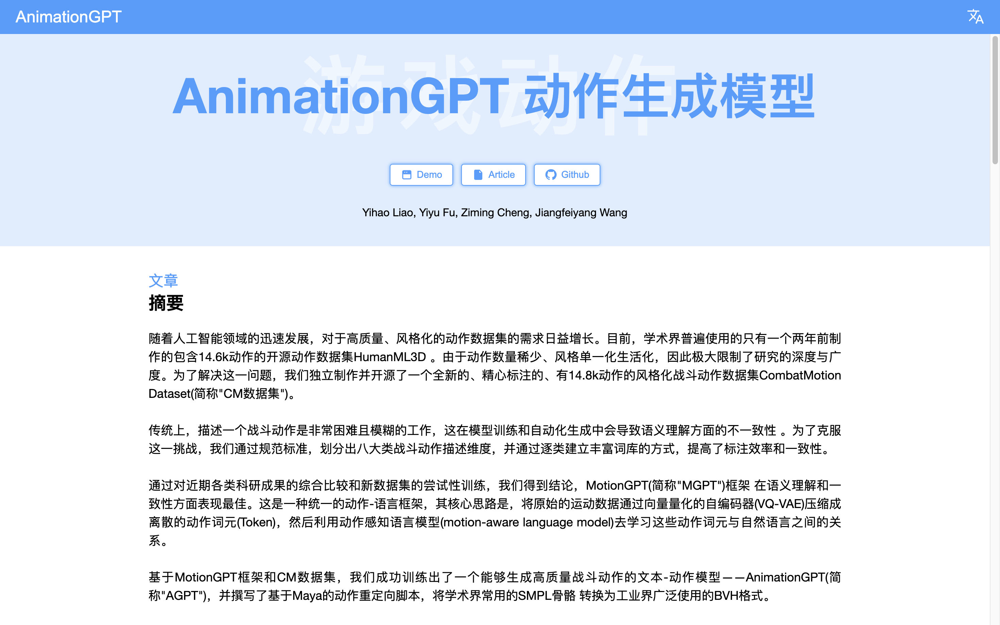
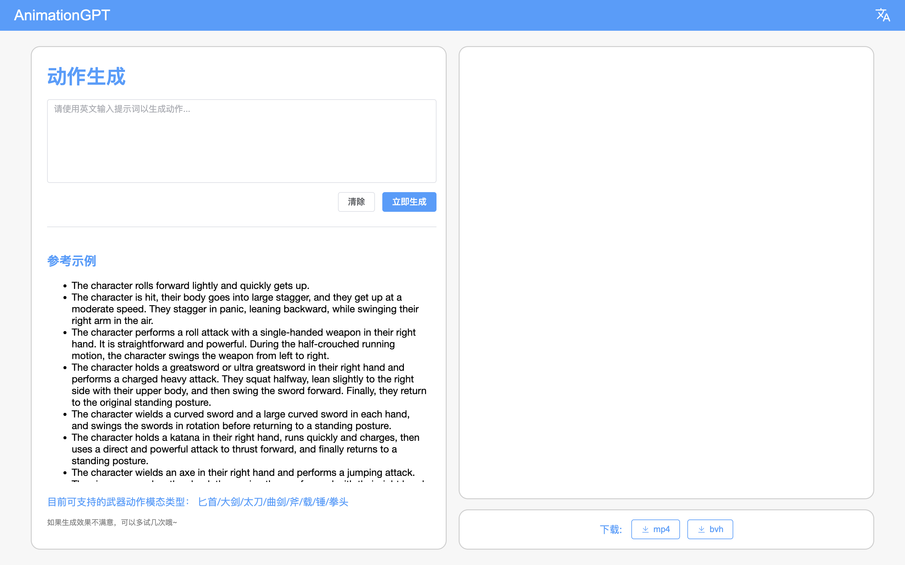

# AnimationGPT

本仓库是 AnimationGPT 的前端部分，
使用 Vue3 和 Element 编写了用于介绍和运行 Demo 的页面。

后端部分：[animationGPT-backend](https://github.com/Fucloud233/animationGPT-backend)

## 页面截图

### 介绍页面

### Demo 页面

## 配置说明

### 1. Nginx 配置

本项目 Nginx 对生成后的网页静态文件进行部署，具体的配置文件可以参考 [docs/nginx.conf](./docs/nginx.conf)。

本项目还提供了以下两个脚本用于构建和部署网页项目。

-   `build.sh`：使用 `npm` 构建静态文件，并通过 scp 上传到服务器上。
-   `deploy.sh`：解压压缩包，并拷贝到 `/usr/share/nginx/html` 中

### 2. 网页配置

本项目还提供了配置文件，允许项目被打包成动态文件后动态地修改网页内容配置，
详情请查看 [config.js](public/configs.js)。
